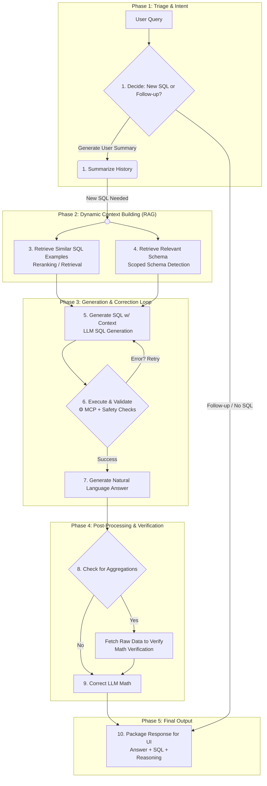
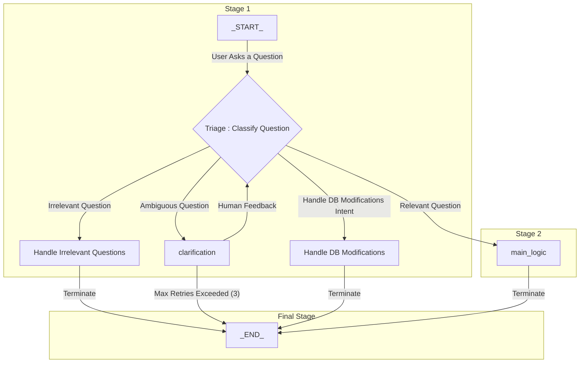

How to run

- >  $env:PYTHONPATH = "."
- fastmcp dev .\app\mcp\server.py

STDIO-
- > uv run "D:\PORTFOLIO PROJECTS\MCP Text-SQL\app\mcp\server.py"

With stremable-http
run the server file first
the connect on browser e.g  http://127.0.0.1:8005/mcp

-> [Check the inspector documentation](https://medium.com/@laurentkubaski/how-to-use-mcp-inspector-2748cd33faeb)

Force kill all MCP tasks
-  netstat -ano | findstr :6277
-  taskkill /PID 61079 /F
- > Get-Process | Where-Object { $_.ProcessName -like "*python*" -or $_.ProcessName -like "*fastmcp*" -or $_.ProcessName -like "*mcp*" } | Stop-Process -Force

