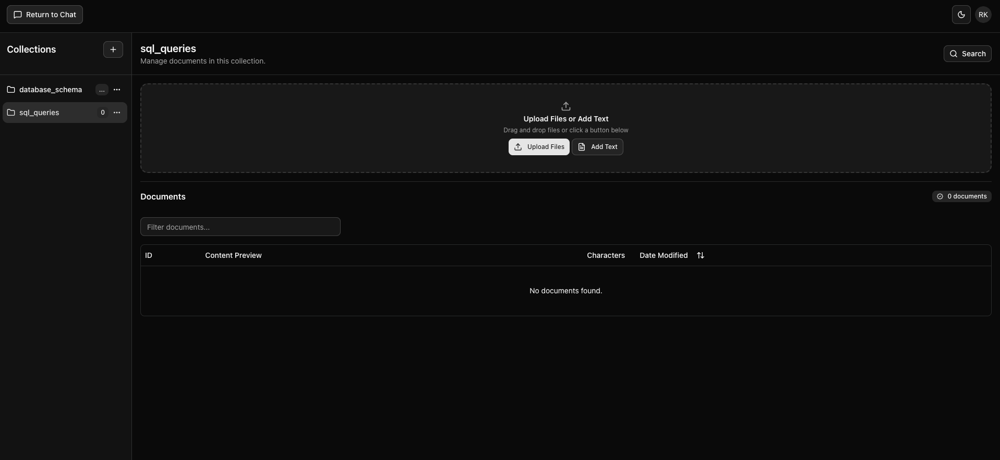
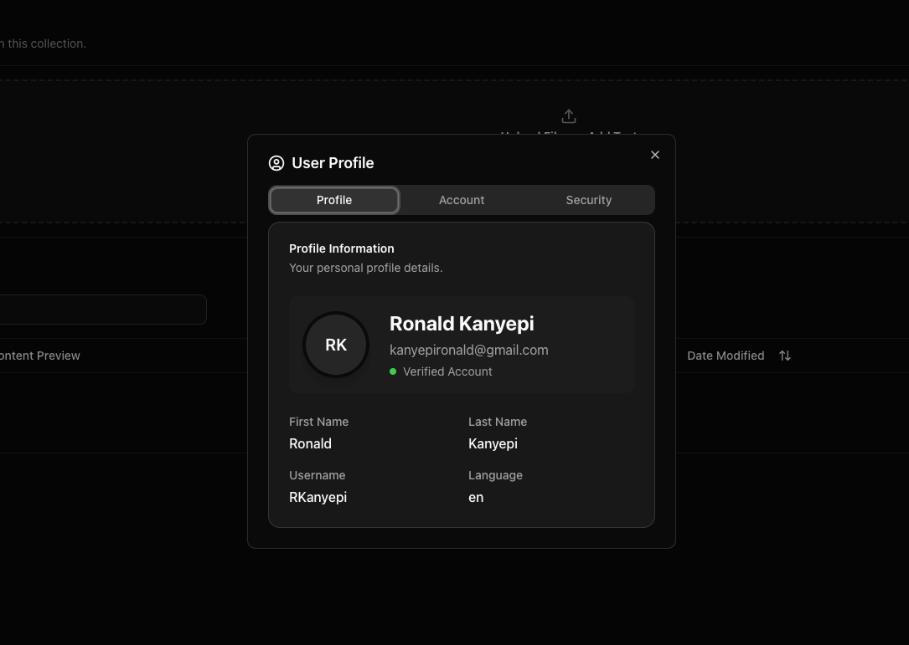
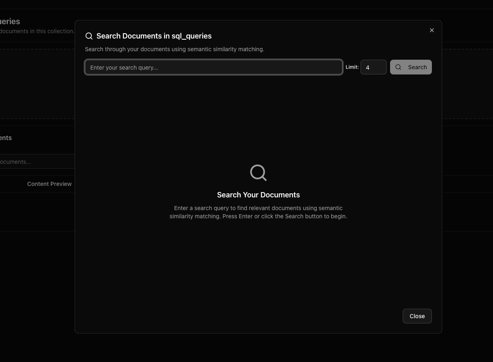
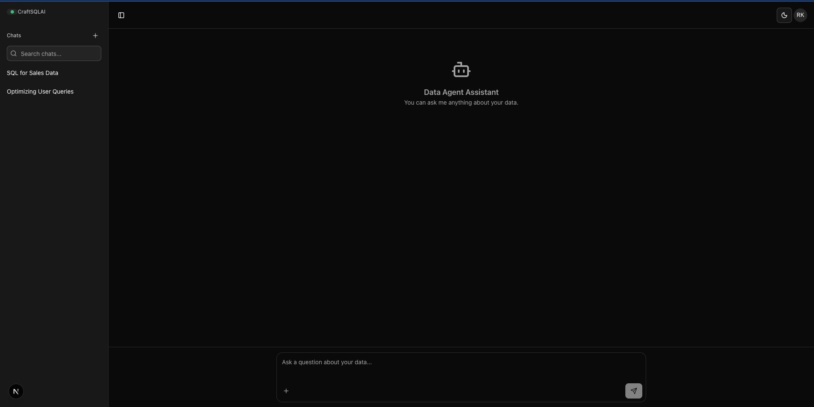
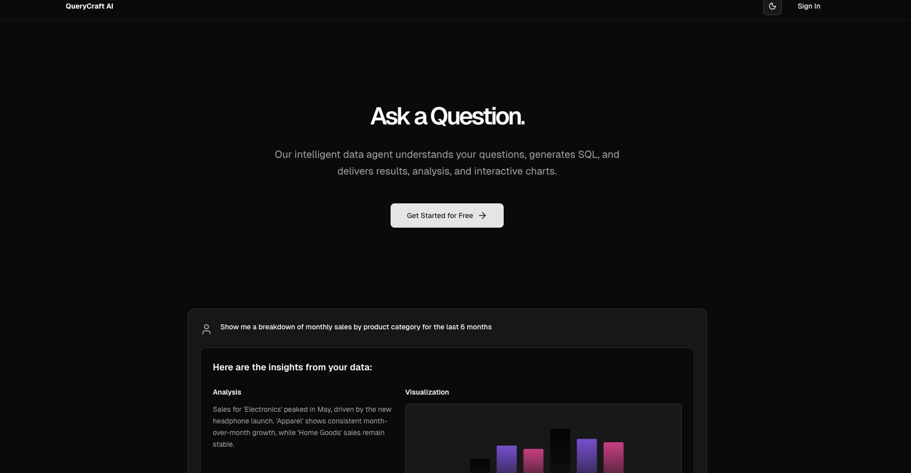
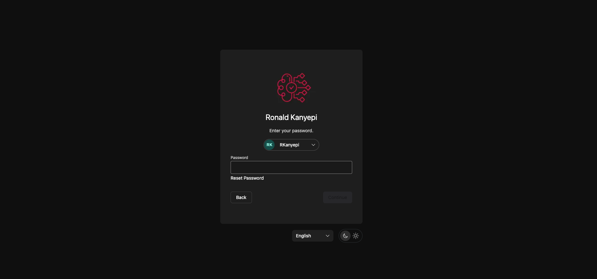

# QueryCraft AI Frontend

This is the frontend for the QueryCraft AI application, built with [Next.js](https://nextjs.org), [shadcn/ui](https://ui.shadcn.com/docs), and secured with [Zitadel](https://zitadel.com/) for authentication.

## Getting Started

First, set up the necessary environment variables by copying the example file:

```bash
cp .env.example .env.local
```

Next, run the development server:

```bash
npm run dev
```

Open [http://localhost:3000](http://localhost:3000) with your browser to see the result.

---

## Authentication with Zitadel

This application uses [NextAuth.js](https://next-auth.js.org/) to integrate with Zitadel for secure OIDC-based authentication. The setup includes route protection via middleware, custom authentication pages, and role management.

### Environment Variables

To connect with your Zitadel instance, you must configure the following variables in your `.env.local` file. You can find these values in your Zitadel project console.

```env
# The secret is used to encrypt the NextAuth.js JWT.
NEXTAUTH_SECRET="your_nextauth_secret" # pragma: allowlist secret

# Zitadel Configuration
ZITADEL_ISSUER="http://localhost:8080"
ZITADEL_CLIENT_ID="your_zitadel_client_id"
ZITADEL_CLIENT_SECRET="your_zitadel_client_secret" # pragma: allowlist secret

# This is used for the logout redirect and must be accessible from the client-side.
NEXT_PUBLIC_ZITADEL_ISSUER="http://localhost:8080"

# The client ID of your backend API application in Zitadel, used for the audience claim.
ZITADEL_BACKEND_CLIENT_ID="your_zitadel_backend_client_id"
```

### Core Configuration (`src/lib/auth.ts`)

The main NextAuth.js options are defined in `src/lib/auth.ts`. This file configures the Zitadel OIDC provider, sets up custom pages, and defines the session strategy. It is kept separate to be reusable across different parts of the application, like the API routes and middleware.

```typescript
// src/lib/auth.ts
export const authOptions: NextAuthOptions = {
    providers: [
        {
            id: "zitadel",
            name: "Zitadel",
            type: "oauth",
            wellKnown: `${process.env.ZITADEL_ISSUER}/.well-known/openid-configuration`,
            // ...
        }
    ],
    callbacks: {
        // ...
    },
    pages: {
        signIn: '/auth/signin',
        error: '/auth/error'
    },
    session: {
        strategy: 'jwt',
    }
}
```

### API Authentication Route (`src/app/api/auth/[...nextauth]/route.ts`)

This file serves as the main endpoint for NextAuth.js. It imports the `authOptions` and the `ZitadelProvider`, and handles the OIDC flow. Its callbacks are configured to extract custom claims (like user roles) from the Zitadel profile and add them to the application's JWT.

```typescript
// src/app/api/auth/[...nextauth]/route.ts
import NextAuth from "next-auth";
import ZitadelProvider from "next-auth/providers/zitadel";

export const authOptions = {
  providers: [
    ZitadelProvider({
      // ... provider configuration
    }),
  ],
  callbacks: {
    async jwt({ token, profile }) {
      if (profile) {
        token.roles = profile["urn:zitadel:iam:org:project:roles"];
      }
      return token;
    },
    async session({ session, token }) {
      session.roles = token.roles;
      return session;
    },
  },
};

const handler = NextAuth(authOptions);
export { handler as GET, handler as POST };
```

### Route Protection (`src/middleware.ts`)

To protect routes and enforce authentication, a middleware is used. It checks for a valid session JWT on specific routes. If a user tries to access a protected route (e.g., `/chat`, `/rag`) without a valid token, they are redirected to the custom sign-in page.

```typescript
// src/middleware.ts
import { NextResponse } from "next/server";
import type { NextRequest } from "next/server";
import { getToken } from "next-auth/jwt";

const protectedRoutes = ["/chat", "/rag"];

export default async function middleware(request: NextRequest) {
    const token = await getToken({
        req: request,
        secret: process.env.NEXTAUTH_SECRET
    });

    const isProtected = protectedRoutes.some((route) =>
        request.nextUrl.pathname.startsWith(route)
    );

    if (isProtected && !token) {
        const signInUrl = new URL("/auth/signin", request.url);
        return NextResponse.redirect(signInUrl);
    }

    return NextResponse.next();
}
```

### Custom Pages (`src/app/auth/signin/page.tsx`)

The application uses a custom page for the sign-in experience, located at `/auth/signin`. This page is specified in the `authOptions` configuration. It provides the UI for the user to initiate the Zitadel login flow.

```tsx
// src/app/auth/signin/page.tsx
"use client";
import { signIn } from "next-auth/react";
import { Button } from "@/components/ui/button";

export default function SignInPage() {
  return (
    <div>
      <h1>Sign In</h1>
      <p>You'll be securely redirected to Zitadel for authentication</p>
      <Button onClick={() => signIn("zitadel", { callbackUrl: "/chat" })}>
        Continue with Zitadel
      </Button>
    </div>
  );
}
```

### Sample UI Images

<div style="display:flex; flex-wrap: wrap; gap: 10px;">
  
  
  
  
  
  
</div>
