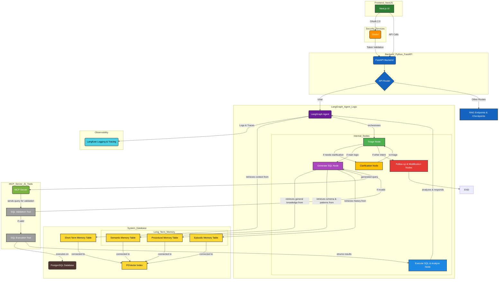
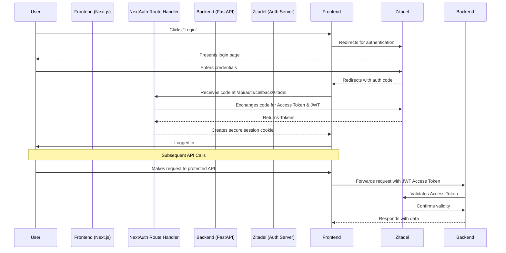
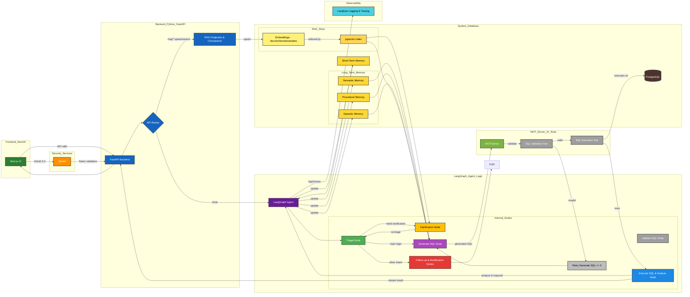

# Text-to-Analytics Platform

## 1. Project Overview & Business Problem

The Text-to-Analytics Platform is an advanced data analytics solution designed to bridge the gap between natural language and structured databases. It addresses a critical business problem: the inability of non-technical users to directly query and analyze complex datasets.

By leveraging a sophisticated AI agent, the platform transforms user questions---posed in plain English---into precise PostgreSQL queries. It then executes these queries, analyzes the results, and delivers actionable insights, visualizations, and summaries. This empowers stakeholders to make faster, data-driven decisions without writing a single line of SQL, effectively democratizing data access and streamlining analytical workflows.

**Core Business Value:**

- **Automation:** Automates the analytics workflow from question to insight.
- **Accessibility:** Enables business users, analysts, and executives to self-serve their data needs.
- **Efficiency:** Reduces the time and effort required to extract insights from databases.
- **Data-Driven Culture:** Fosters a culture of data-driven decision-making by removing technical barriers.

---

## 2. Technical Architecture

The platform is built on a modern, decoupled architecture featuring a Next.js frontend, a FastAPI backend, and a suite of services for authentication, orchestration, and observability.



**Key Components:**

-   **Frontend:** Next.js 15 + React 19, Radix UI, Lucide Icons, Tailwind CSS, Zustand for state management, NextAuth.js + Zitadel for OAuth 2.0.

-   **Backend:** FastAPI with Uvicorn, RESTful endpoints, secured via fastapi-zitadel-auth, RBAC, slowapi rate-limiting.

-   **Database & Vector Store:** PostgreSQL with pgvector, Docker-managed, stores schema embeddings for AI agent reasoning.

-   **AI Orchestration:** LangGraph for multi-step reasoning (SQL generation, validation, execution), Langfuse for tracing and observability.

* * * * *

3\. Core Workflows & Diagrams
-----------------------------

### User Authentication Flow



### Text-to-SQL Agent Data Flow



* * * * *

4\. Core Features & Endpoints
-----------------------------

-   `GET /health`: Application health check

-   `POST /chat`: Main endpoint for Text-to-SQL agent (secured)

-   `GET /users/me`: Authenticated user profile

-   `GET /collections`: Lists data collections

-   `POST /documents/upsert`: Upload & index documents

-   `POST /search`: Semantic search over documents

-   `GET /analytics`: Retrieve Langfuse analytics

* * * * *

5\. Module Responsibilities
---------------------------

```
graph TD
    subgraph Core Logic
        A["app/agent/graph.py"]
        B["app/services/memory.py"]
    end

    subgraph API Layer
        C["app/api/api.py"]
        D["app/api/endpoints/chat.py"]
    end

    subgraph Infrastructure
        E["app/core/auth.py"]
        F["app/core/db.py"]
        G["app/core/langfuse.py"]
    end

    A --> B
    C --> D
    D --> A
    A --> E
    A --> F
    A --> G

```

-   `app/agent/graph.py`: LangGraph agent, all nodes & logic

-   `app/api/`: FastAPI routers and endpoints

-   `app/core/`: Core components (auth, DB, Langfuse)

-   `app/services/`: MemoryTools & business logic

* * * * *

6\. Setup & Installation
------------------------

### Prerequisites

-   Docker & Docker Compose

-   Python 3.13+

-   Node.js + npm

-   Running Zitadel instance

### 1\. Environment Variables

```
# Copy .env.example in each directory and configure
cp Code/backend/.env.example Code/backend/.env
cp Code/frontend/.env.example Code/frontend/.env
cp Services/.env.example Services/.env

```

### 2\. Start Services (Docker & Makefile)

```
# Start all services
make start

# Rebuild and start
make rebuild

# Stop all services
make stop

# Follow logs
make logs

# Check service status
make status

```

Docker Compose files live in `Services/`:

```
docker-compose -f Services/docker-compose.db.yaml up -d
docker-compose -f Services/docker-compose.langfuse.yaml up -d
docker-compose -f Services/docker-compose.zitadel.yaml up -d

```

### 3\. Backend Setup

```
cd Code/backend

# Create virtual environment & install dependencies
make setup
source .venv/bin/activate

# Synchronize dependencies
uv sync

# Run Alembic migrations
make migrate
# or manually
uv run alembic upgrade head

# Start FastAPI server
uvicorn main:app --reload

```

### 4\. Frontend Setup

```
cd Code/frontend
npm install
npm run dev

```

-   Frontend: [http://localhost:3000](http://localhost:3000/)

-   Backend API: [http://localhost:8005](http://localhost:8005/)

### 5\. Dev Tools

-   `make lint` / `make format`: Lint and format code

-   `make studio`: LangGraph Studio

-   `make inspector`: MCP dev server

-   `make kill-port PORT=8000`: Kill process on port

* * * * *

7\. Business & Technical Summary
--------------------------------

This platform demonstrates modern full-stack engineering:

-   **AI & Automation:** LangGraph-driven text-to-SQL agent

-   **Observability:** Langfuse traces & analytics

-   **Security:** Zitadel OAuth 2.0 + RBAC

-   **DevOps-Friendly:** Docker, Makefile, Alembic migrations

-   **User-Friendly:** Non-technical users can analyze data seamlessly
