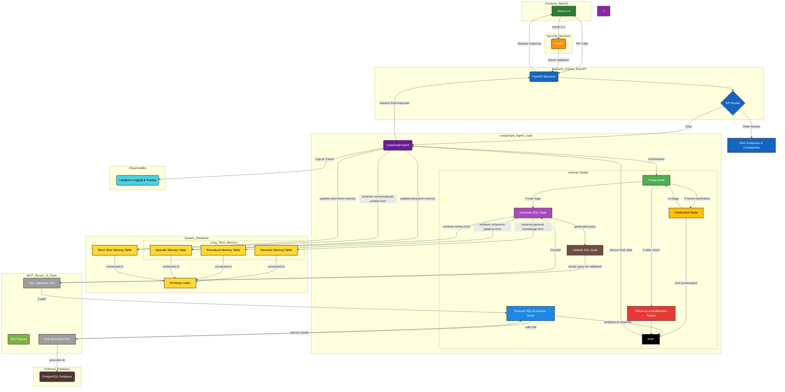
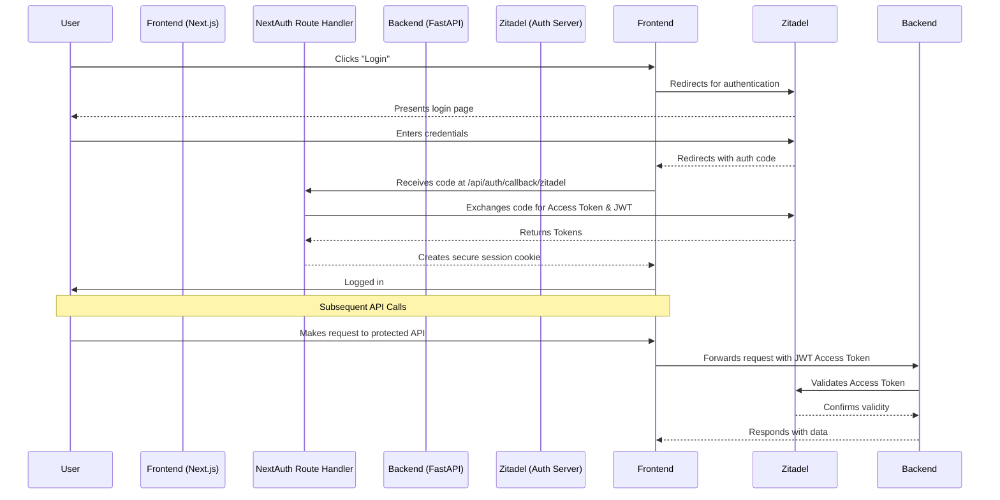
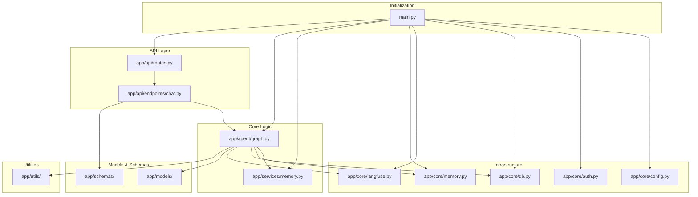

### QueryCraft AI

QueryCraft AI is a powerful tool that helps everyone, even those without technical expertise, get the data they need from complex databases. It solves a common business problem: getting stuck when you can't write code to find the answers you're looking for.

Think of it as your personal data analyst. You simply ask a question in plain English, such as "How many new customers did we get last week?" and the platform handles the rest. It uses AI to convert your question into a precise database query, runs the query, interprets the results, and provides a clear summary with visuals.

Ultimately, this platform is designed to make work easier and organizations smarter. It helps you:

* **Automate** complex tasks, so you can go from question to insight quickly.
* **Access** data directly, without relying on a technical team.
* **Boost efficiency** by reducing the time and effort spent on data analysis.
* **Build a data-driven culture** by making information accessible to everyone.


---

## 2. Technical Architecture

The platform is built on a modern, decoupled architecture featuring a Next.js frontend, a FastAPI backend, and a suite of services for authentication, orchestration, and observability.



**Key Components:**

- **Frontend:** Next.js 15 + Shadcn for UI, NextAuth.js + Zitadel for OAuth 2.0 authentication.
- **Backend:** FastAPI with Uvicorn, serving RESTful endpoints; secured via fastapi-zitadel-auth with RBAC and slowapi for rate limiting.
- **Database & Vector Store:** PostgreSQL with pgvector, managed via Docker; stores both application data and schema embeddings used by AI agents.
- **AI Orchestration:** LangGraph handles multi-step reasoning (SQL generation → validation → execution), MCP provides structured prompts, tools, and resources, and Langfuse handles tracing, observability, and evaluation of agent actions and outputs.


* * * * *

3\. Core Workflows & Diagrams
-----------------------------

### User Authentication Flow



* * * * *

4\. Core Features & Endpoints
-----------------------------

4. Core Features & Endpoints
-----------------------------

- `GET /health`: Application health check (public, no auth required)

- `POST /chat`: Main endpoint for Text-to-SQL agent (requires Zitadel OAuth 2.0)

- `GET /users/me`: Retrieve authenticated user profile (requires OAuth)

- `GET /collections`: List all collections (requires OAuth)

- `POST /collections`: Create a new collection (requires OAuth)

- `GET /collections/{collection_id}`: Retrieve a specific collection (requires OAuth)

- `PATCH /collections/{collection_id}`: Update a collection (requires OAuth)

- `DELETE /collections/{collection_id}`: Delete a collection (requires OAuth)

- `POST /documents/{collection_id}`: Upload and index documents to a collection (requires OAuth, multipart/form-data)

- `GET /documents/{collection_id}`: List documents in a collection (requires OAuth, supports `limit` & `offset` query params)

- `DELETE /documents/{collection_id}/{document_id}`: Delete a specific document (requires OAuth)

- `POST /documents/{collection_id}/search`: Semantic search over documents (requires OAuth)

- `GET /analytics`: Retrieve Langfuse analytics (requires OAuth)

* * * * *

5\. Module Responsibilities
---------------------------



- `app/agent/`: LangGraph agent, defining all orchestration nodes,tools,state and logic
- `app/api/`: FastAPI routers and endpoint handlers
- `app/core/`: Core components (auth, DB, Langfuse, memory, config)
- `app/services/`: MemoryTools and business logic
- `app/models/`: ORM models for database tables
- `app/schemas/`: Pydantic schemas for request/response validation
- `app/utils/`: Helper functions and shared utilities


* * * * *

6\. Setup & Installation
------------------------

### Prerequisites
-   Docker & Docker Compose
-   Python 3.13+
-   [uv](https://docs.astral.sh/uv/getting-started/installation/) for dependency management in python
-   Node.js + npm
-   Running Zitadel instance
-   Running Langfuse instance / Cloud - they have a generous offer

### 1\. Environment Variables

```
# Copy .env.example in each directory and configure
cp Code/backend/.env.example Code/backend/.env
cp Code/frontend/.env.example Code/frontend/.env
cp Services/.env.example Services/.env

```

### 2\. Start Services (Docker & Makefile)

```
# Start all services
make start

# Rebuild and start
make rebuild

# Stop all services
make stop

# Follow logs
make logs

# Check service status
make status

```

Docker Compose files live in `Services/`:

```
docker-compose -f Services/docker-compose.db.yaml up -d
docker-compose -f Services/docker-compose.langfuse.yaml up -d
docker-compose -f Services/docker-compose.zitadel.yaml up -d

```

### 3\. Backend Setup

```
cd Code/backend

# Create virtual environment & install dependencies
make setup
source .venv/bin/activate

# Synchronize dependencies
uv sync

# Run Alembic migrations
make migrate
# or manually
uv run alembic upgrade head

# Start FastAPI server
uvicorn main:app --reload

```

### 4\. Frontend Setup

```
cd Code/frontend
npm install
npm run dev

```

-   Frontend: [http://localhost:3000](http://localhost:3000/)
-   Backend API: [http://localhost:8005](http://localhost:8005/)
-   Zitadel Console: [http://localhost:8080](http://localhost:8080/)
-   Langfuse: [http://localhost:3000](http://localhost:3000/)
-   MCP Server: [http://localhost:8004](http://localhost:8004/)

### 5\. Dev Tools

-   `make lint` / `make format`: Lint and format code

-   `make studio`: LangGraph Studio

-   `make inspector`: MCP dev server

-   `make kill-port PORT=8000`: Kill process on port

* * * * *

7\. Business & Technical Summary
--------------------------------

Query Craft AI for easy analytics:

-   **AI & Automation:** LangGraph-driven text-to-SQL agent

-   **Observability:** Langfuse traces & analytics

-   **Security:** Zitadel OAuth 2.0 + RBAC

-   **DevOps-Friendly:** Docker, Makefile, Alembic migrations,Gituhub Actions & PreCommit Hooks

-   **User-Friendly:** Non-technical users can analyze data seamlessly
